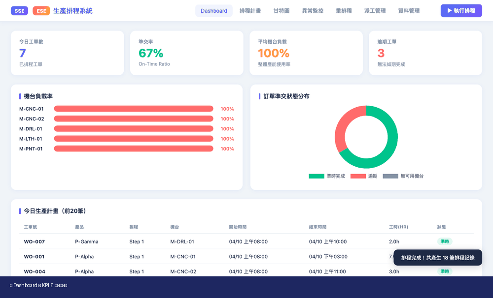

# 🏭 生產排程系統 — SSE + ESE

> 智慧化排程 · 異常即時應對 · 派工精準管控

**[🚀 線上 Demo →](https://gbi0426-terry.github.io/bpm-dashboard/scheduling.html)**

---

## 📸 系統畫面



---

## ✨ 功能亮點

| 模組 | 說明 |
|------|------|
| 📊 **儀表板** | 即時 KPI、瓶頸站分析、準交率、機台負載一覽 |
| 📅 **排程計畫** | EDD+SPT 演算法自動排程，每張工單附最佳解建議 |
| 📈 **甘特圖** | 機台時程可視化，工單進度一目了然 |
| 🚨 **異常監控** | 設備故障／缺料／急單即時告警，嚴重度分級 |
| 🔄 **重排程** | 異常後秒級自動重排，人類可讀影響分析 |
| 👷 **派工管理** | 技能匹配、手動指派、進度回報、一鍵完工 |

---

## 🧠 技術架構

```
┌─────────────────────────────────────┐
│  前端：HTML5 + CSS3 + JavaScript    │
│  （純單檔，無需框架，無需安裝）      │
├─────────────────────────────────────┤
│  SSE 排程引擎                        │
│  EDD + SPT 啟發式演算法              │
│  純整數毫秒運算，毫秒級完成          │
├─────────────────────────────────────┤
│  ESE 異常引擎                        │
│  Before/After 快照比對               │
│  乾淨基線重排，準確影響分析          │
├─────────────────────────────────────┤
│  圖表：Chart.js 4.4                  │
│  甘特圖、瓶頸分析圖                  │
├─────────────────────────────────────┤
│  對接層（預留）：REST API            │
│  可對接 ERP / MES 系統              │
└─────────────────────────────────────┘
```

---

## 🚀 快速開始

### 直接開啟（最簡單）
```bash
open scheduling.html
```

### 本機伺服器
```bash
python3 -m http.server 8765
# 瀏覽器開啟 http://localhost:8765/scheduling.html
```

### GitHub Pages
已部署：**https://gbi0426-terry.github.io/bpm-dashboard/scheduling.html**

---

## 📂 檔案說明

```
.
├── scheduling.html          # 主系統（單一檔案包含全部功能）
├── index.html               # 首頁跳轉
├── scheduling_demo.gif      # 系統 Demo 動畫
└── 生產排程系統_產品介紹.pptx  # 產品簡報
```

---

## 📋 排程演算法

- **SSE（Schedule Sequencing Engine）**：依 EDD（最早到期日）排序工單，以 SPT（最短工時優先）在機台間分配工序，並確保工序依賴順序正確
- **ESE（Exception Scheduling Engine）**：異常發生時自動觸發重排，以乾淨基線（clean baseline）避免舊異常污染，並輸出可讀的 before/after 差異報告

---

## 🏢 導入說明

1. **資料建檔**（1–2 週）：匯入工單、機台、工序路徑、標準工時
2. **試行排程**（2–4 週）：平行運行，對比人工排程，調整參數
3. **正式上線**：全面切換，持續優化

---

> Made with ❤️ — Single-file production scheduling system
